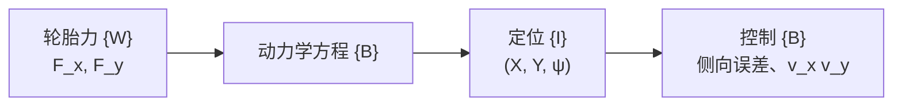
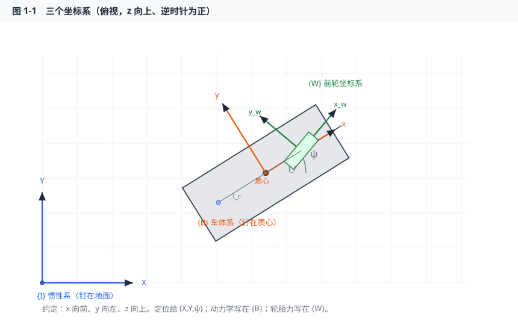
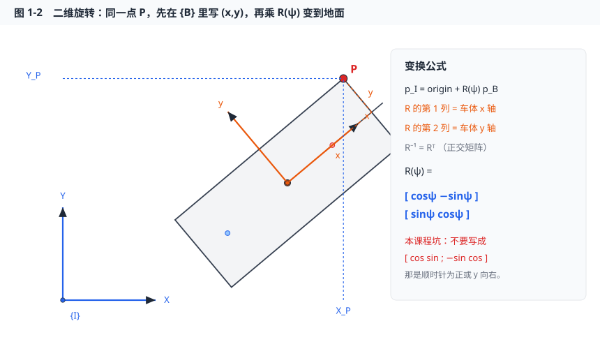
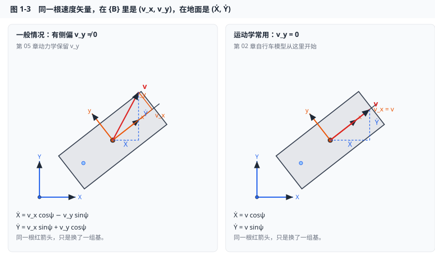
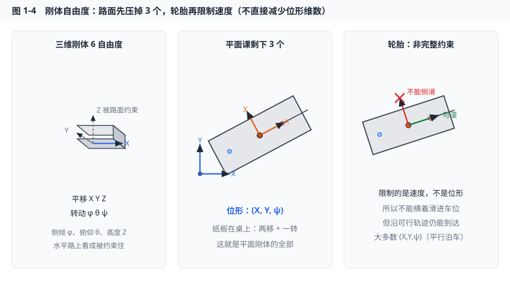
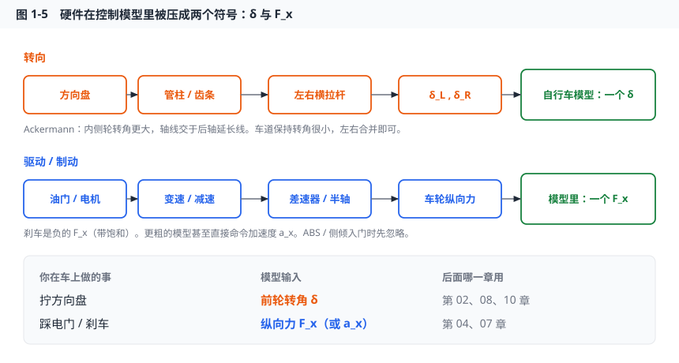
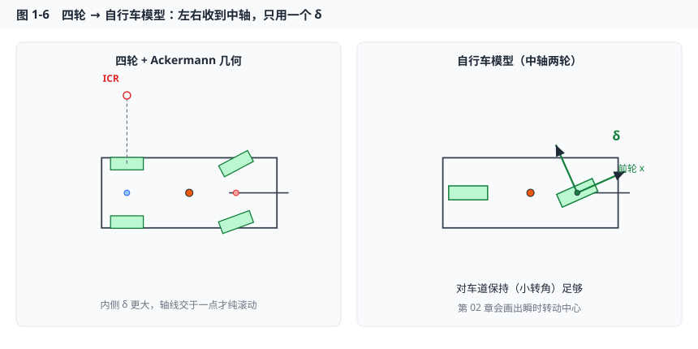

# 第 01 章课件　坐标系、刚体与车辆结构

## 1. 本章你将获得什么

- 能在纸上画出惯性系 $\{I\}$ 与车体系 $\{B\}$，并写出二维旋转矩阵。
- 能把车体系下的速度转到地面，得到 $\dot X,\dot Y$。
- 能数清「整车刚体」在平面上有几个自由度，以及轮胎约束如何减少可独立指定的速度。
- 能把方向盘、油门、刹车对应到后面章节要用的 $\delta$ 和纵向力 $F_x$。

**拖参数看图（推荐）：** 打开 [坐标系交互图](https://zhaowentaoone.github.io/vehicle-theory-autonomous-driving/ch01-frames.html)（浏览器里拖 \(\psi,\delta,v_x,v_y\)，和静态图同一套约定）。本地也可打开 [`docs/ch01-frames.html`](../docs/ch01-frames.html)。

## 2. 和自动驾驶哪一层有关

定位、规划、控制的交界。定位给 $(X,Y,\psi)$；控制在车上看侧向误差；轮胎力写在轮胎坐标系。三者必须能互转。

**图要建立的直觉**：不是三套物理世界，是同一辆车的三种写法。转来转去靠的就是下面的 $R(\psi)$。

## 3. 直觉

把车当成桌上的一个纸板：

- 纸板在桌上的位姿：两个移动 + 一个转动，这就是平面刚体的 3 个自由度。
- 纸板上写着「车头方向」，这就是车体系的 $x$ 轴。
- 你坐在车上觉得「我正在向左飘」，那是车体系的 $v_y$；路上看这辆车既在往北走也在往东走，那是 $\dot X,\dot Y$。

同一物理速度，两个坐标系下分量不同，**旋转矩阵只是换一组基**。后面图 1-3 会把这根速度画成「橙直角边 vs 蓝直角边」。

## 4. 符号表

见 [符号与约定.md](../符号与约定.md)。本章用到：

| 符号 | 含义 |
|------|------|
| $X,Y$ | 质心在惯性系中的坐标 |
| $\psi$ | 横摆角：车体 $x$ 相对惯性 $X$ 的转角，逆时针正 |
| $v_x,v_y$ | 质心速度在车体系的投影 |
| $\delta$ | 前轮转角 |
| $l_f,l_r,L$ | 质心到前/后轴距离、轴距 |

## 5. 推导

### 5.1 三个坐标系（平面课只深入前两个）

1. **惯性系 $\{I\}$**  
   固连地面。自动驾驶局部规划常用「当前车道切向为 $X$」的临时惯性系，或地图 ENU。本课程仿真默认一个固定的 $OXY$。

2. **车体系 $\{B\}$**  
   原点取质心。$x$ 向前，$y$ 向左，$z$ 向上。车辆动力学方程写在这里最干净，因为轮胎位置相对质心是常数。

3. **轮胎坐标系**  
   每个轮有自己的 $x$（轮心前进方向）。前轮相对车体转了 $\delta$，所以前轮纵向力并不沿着车体 $x$。第 03 章用。

看图时按颜色记：**蓝 = 地面 $\{I\}$，橙 = 车体 $\{B\}$，绿 = 前轮 $\{W\}$**。$\psi$ 是从惯性 $X$ 转到车体 $x$ 的角（逆时针正）；$\delta$ 是前轮相对车体再转的角。质心到前、后轴的距离就是 $l_f$、$l_r$。

### 5.2 二维旋转

点 $P$ 在车体系坐标为 $(x,y)$，车体原点在惯性系为 $(X,Y)$、转角 $\psi$，则惯性系坐标：

$$
\begin{bmatrix} X_P \\ Y_P \end{bmatrix}
=
\begin{bmatrix} X \\ Y \end{bmatrix}
+
R(\psi)
\begin{bmatrix} x \\ y \end{bmatrix},
\quad
R(\psi)=
\begin{bmatrix}
\cos\psi & -\sin\psi \\
\sin\psi & \cos\psi
\end{bmatrix}
$$

$R$ 的第一列是车体 $x$ 轴在惯性系的方向，第二列是车体 $y$ 轴。逆变换：

$$
\begin{bmatrix} x \\ y \end{bmatrix}
=
R(\psi)^\top
\begin{bmatrix} X_P-X \\ Y_P-Y \end{bmatrix}
$$

因为 $R$ 是正交矩阵，$R^{-1}=R^\top$。

橙虚线把 $P$ 拆成车体里的 $(x,y)$；蓝虚线是同一点在地面的 $(X_P,Y_P)$。$R$ 的第一列就是图里那根橙色 $x$ 轴在蓝色系里的方向余弦。

**常见坑**：有人把 $R$ 写成 $\begin{bmatrix} \cos & \sin \\ -\sin & \cos \end{bmatrix}$，那是顺时针为正或 $y$ 向右的约定。本课程不要混。

### 5.3 速度变换（后面每一章都用）

质心速度在车体系为 $(v_x,v_y)$，则地面速度：

$$
\dot X = v_x\cos\psi - v_y\sin\psi
$$

$$
\dot Y = v_x\sin\psi + v_y\cos\psi
$$

这就是上面 $R(\psi)$ 乘 $\begin{bmatrix}v_x\\v_y\end{bmatrix}$。

左边：红箭头是 $v$，橙直角边是 $v_x,v_y$，蓝虚线直角边是 $\dot X,\dot Y$。公式只是「把橙分量变到蓝轴上」。右边令 $v_y=0$，就是第 02 章要用的 $\dot X=v\cos\psi$。

若再假设**无侧向速度** $v_y=0$，且 $v_x=v$，就得到运动学常用式：

$$
\dot X=v\cos\psi,\quad \dot Y=v\sin\psi
$$

第 02 章自行车模型从这里开始。动力学模型（第 05 章）会保留 $v_y\neq 0$。

### 5.4 刚体、自由度、约束

- **刚体**：车上任意两点距离不变。整车（忽略悬架）在三维有 6 个自由度：$(X,Y,Z,\phi,\theta,\psi)$。
- **平面课**：认为在水平路上，$Z,\phi,\theta$ 被路面约束住，剩下 $(X,Y,\psi)$。
- **轮胎纯滚动无侧滑**（运动学假设）：接触点速度沿轮胎平面，侧向速度为 0。这是**非完整约束**——限制速度，不直接减少位形维数。所以车不能侧向滑入车位，但可以沿可行轨迹到达大多数 $(X,Y,\psi)$（平行泊车就是在绕这个约束想办法）。

后轴中心在车体系坐标 $(x,y)=(-l_r,0)$（若原点在质心）。无侧滑时后轴侧向速度为 0，会导出 $\dot Y_r=\dot\psi$ 与 $v$ 的关系，第 02 章展开。

左：三维刚体本来有 6 个数。中：本课程当车贴在水平桌面上，只剩 $(X,Y,\psi)$。右：绿箭头是「可以滚」，红叉是「不能侧向滑」——这限制的是**速度**，所以平行泊车仍然能到达大多数位姿，只是必须绕着走。

### 5.5 车辆结构扫盲（只保留控制需要的）

你不需要成为底盘设计师，但要知道模型把硬件压成了什么。

后面写控制器时，你不会再出现「齿轮齿条」这几个字，只会出现 $\delta$ 和 $F_x$。但要记得：方向盘转角还要除以转向比才是 $\delta$。

**转向**

- 方向盘 → 转向管柱 → 齿轮齿条 → 左右转向横拉杆 → 左右前轮转角 $\delta_L,\delta_R$。
- **Ackermann 几何**：内侧轮转角大于外侧，使两轮轴线交于后轴延长线上一点，低速尽量纯滚动。第 02 章画图。
- **自行车模型**：把左右轮合并到中轴，只用一个 $\delta$。对车道保持这种「转角很小」的工况足够。

左图内侧轮转得更厉害，轴线交于后轴延长线上的瞬时转动中心（ICR）。右图把左右合并，这就是后面每一章默认的自行车转向。

**驱动与制动**

- 燃油车：发动机 → 离合器/液力变矩器 → 变速器 → 差速器 → 半轴。
- 电动车：电机 → 减速器 → 差速器（或轮边/轮毂电机）。
- 控制模型常把这一切压成：**作用在车辆质心或车轮上的纵向力 $F_x$**，或更粗地直接命令加速度 $a_x$。第 04、07 章。

**制动**

- 液压盘式制动，ABS 防止抱死。模型里往往是负的 $F_x$，带饱和。

**悬架与侧倾**

- 弹簧阻尼连接车身与车轮。侧向加速度会引起侧倾，从而左右轮载荷转移，改变轮胎力。入门横向控制通常**忽略侧倾**，把载荷当常数。这是第 05 章线性二自由度模型的前提之一。

**传感器与执行器（结构层面）**

- 轮速、方向盘转角、IMU、GNSS：第 12 章。
- 执行器有延迟和带宽。仿真里先当 $\delta$ 瞬时到达，再在第 10 章给转角加变化率约束。

## 6. 离散化 / 实现要点

坐标变换没有微分方程，只是函数。实现时：

- 先写 `R = [[c, -s], [s, c]]`，再 `xy_inertial = origin + R @ xy_body`。
- 角度用 `atan2(y,x)` 而不是 `arctan`，否则象限错。
- 把 $\psi$ 包到 $(-\pi,\pi]$ 或 $[0,2\pi)$，绘图和误差计算前做 `wrap_to_pi`。

案例脚本从车体系的四个车角点变换到地面，画出矩形车体，再绕质心旋转。你应看到矩形在转，而不是变形（刚体）。

## 7. 失效模式与工程坑

- **原点取错**：有的论文原点在后轴中心，有的在质心。$l_f,l_r$ 的定义跟着变，$\dot\psi$ 公式差一项。
- **左手系 / 向右为正**：读 SAE 文献时核对。本课程坚持右手系、$y$ 向左。
- **把方向盘转角当 $\delta$**：中间有转向比（约 15:1）。控制输出若对接实车，必须除以转向比，并加饱和。
- **3D 姿态用欧拉角**：万向节死锁。本课程平面问题用一个 $\psi$ 即可；三维定位常用四元数（第 12 章只提及）。

## 8. 科研延伸

1. Gillespie, T. *Fundamentals of Vehicle Dynamics*. SAE. 第 1 章：车辆轴荷与坐标系。  
2. ISO 8855: 道路车辆 — 动力学与道路保持能力 — 词汇。工业界符号标准，写论文前建议扫一眼。

小问题：找一篇你感兴趣的横向控制论文，抄下它的坐标原点和 $y$ 轴方向，与本课程对照。

## 9. 下一章预告

有了 $R(\psi)$ 和 $\dot X=v\cos\psi$，下一步加入转向：前轮转 $\delta$ 后，整车绕瞬时转动中心转。这就是自行车运动学模型。
