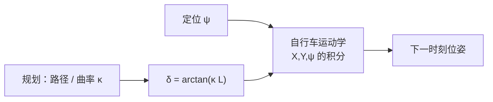
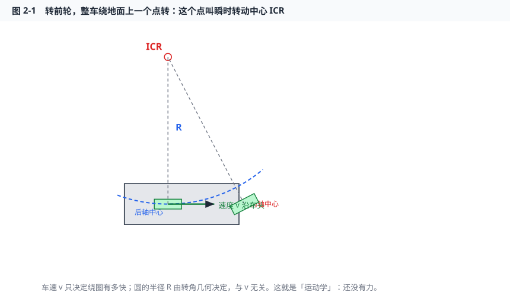
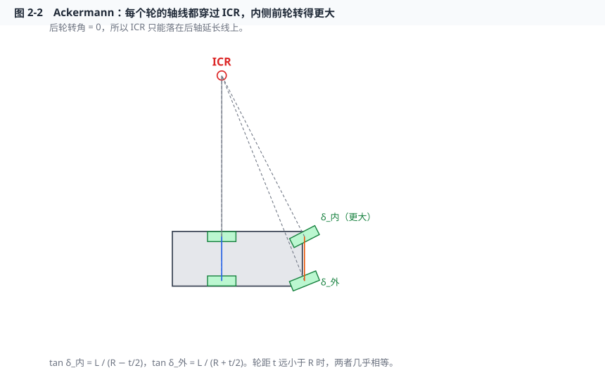
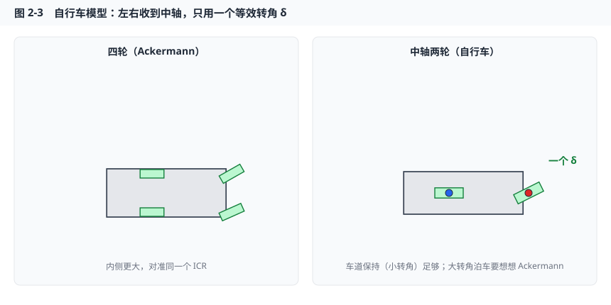
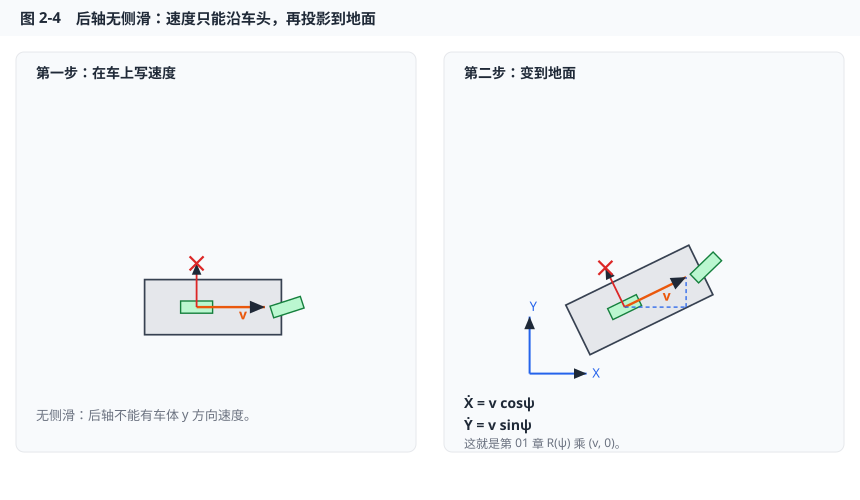
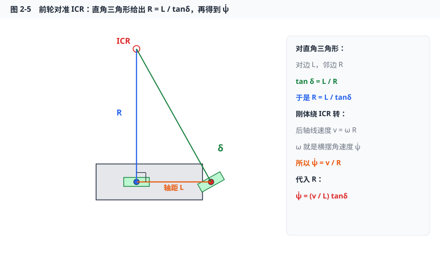
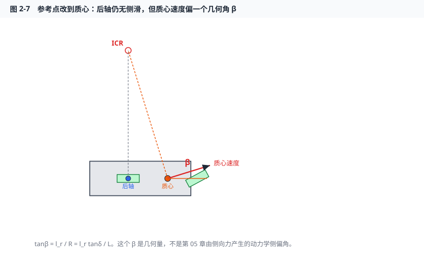
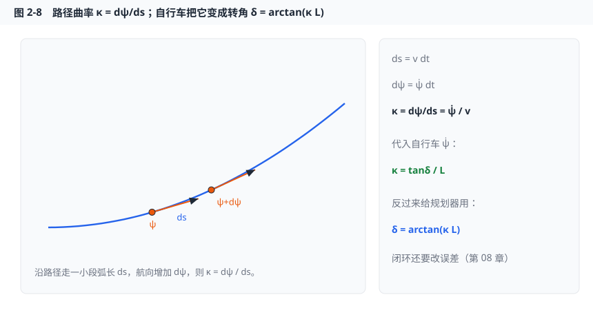
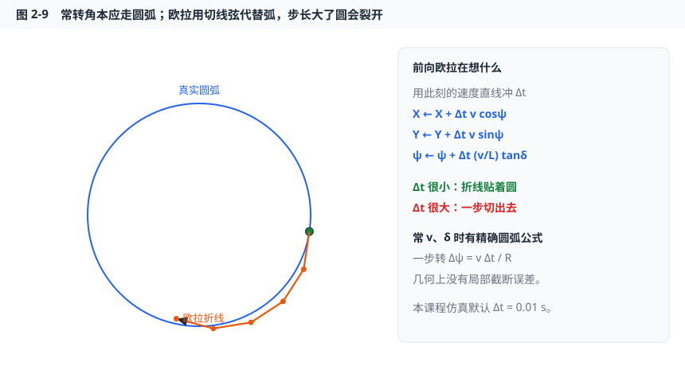
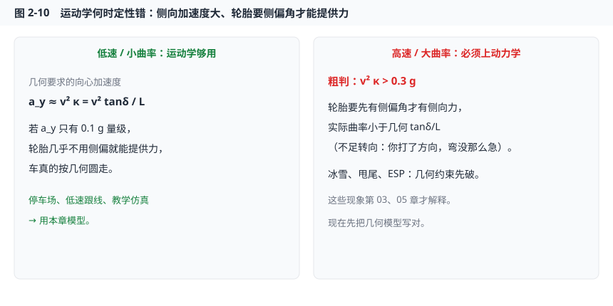

# 第 02 章课件　车辆运动学与自行车模型

## 1. 本章你将获得什么

学完应能自己在纸上走完这条链，而不是背三行公式：

1. 画出瞬时转动中心（ICR），说明为什么左右前轮转角不同。
2. 从「后轴纯滚动、不能侧滑」一步步写出后轴自行车模型。
3. 解释常转角为什么走出圆，以及欧拉离散怎样把圆变成折线。
4. 说出参考点改到质心时多出来的几何侧偏角 $\beta$ 是什么——以及它**不是**第 05 章那个 $\beta$。

**拖参数看图：** [自行车模型与 ICR](https://zhaowentaoone.github.io/vehicle-theory-autonomous-driving/ch02-bicycle.html)（浏览器里拖 $\delta$、$v$，看半径和圆怎么变）。本地打开 [`docs/ch02-bicycle.html`](../docs/ch02-bicycle.html)。

## 2. 和自动驾驶哪一层有关

规划拿它当「这条轨迹车子几何上能不能走」；控制拿它当低速被控对象（Pure Pursuit、运动学 MPC）。感知不直接用，但定位给出的 $\psi$ 会送进这个积分器。

高速、大侧向加速度时，这个模型会**定性地错**。那不是调参能救的，见第 7 节和第 05 章。

## 3. 先建立一个画面：购物车

不要先看公式。想象超市购物车：你转前轮，车不是「往前轮指的方向平移」，而是**绕地面上某个点转圈**。

那个点叫**瞬时转动中心 (Instantaneous Center of Rotation, ICR)**。

三件立刻能用手比划的事：

1. **这一瞬间**，车上每一点都在绕同一个 ICR 转（刚体）。下一瞬间 ICR 可以换地方，所以叫「瞬时」。
2. 你推得快或慢，只改变绕圈的快慢，**不改变这一瞬间圆的半径**。半径由转角的几何决定。
3. 后轮如果不能侧滑，ICR 就不能乱跑——它必须落在后轮轴线的延长线上。否则后轮速度会有侧向分量，轮胎就要擦着走。

看图：蓝点是后轴中心，速度（绿箭头）沿着车头；红点是前轴；ICR 在后轴左侧。虚线圆弧就是后轴中心这一瞬间该走的路。**车速 $v$ 不出现在半径里**——这正是「运动学」三个字的意思：还没有力，只有滚动约束和刚体几何。

下一节把这张图里的 $R$ 用轴距和转角写出来。在那之前，先把四轮车上「左右前轮为什么转得不一样」说清。

## 4. 符号表

见 [符号与约定.md](../符号与约定.md)。本章新增或强调：

| 符号 | 含义 | 注意 |
|------|------|------|
| $L=l_f+l_r$ | 轴距 | 教学车 $2.8\,\mathrm{m}$，不要用地上量的车长 |
| $\delta$ | 自行车模型的**一个**前轮转角 | 四轮时左右不同，见 5.2 |
| $v$ | 参考点处速度大小 | 本节默认参考点是**后轴中心** |
| $R$ | 后轴中心到 ICR 的距离 | 带符号：左转 $R>0$ |
| $\kappa$ | 路径曲率 $1/R_{\mathrm{path}}$ | 与轮胎滑移率不是一个字 |
| $\beta$ | 质心速度相对车头的夹角 | 本章是几何量 |

许多跟踪论文原点不在后轴（Stanley 原文用前轴）。原点一换，公式会差 $l_f$ 或 $l_r$。读论文先找这句话。

## 5. 推导：从「不能侧滑」到三行微分方程

下面每一小节只推一步。看懂图，再看紧跟在图后的那一个式子。

### 5.1 刚体 + 纯滚动：ICR 必须让每个轮的轴线穿过它

刚体绕 ICR 转时，接触点的速度垂直于「该点到 ICR 的连线」。

轮胎如果**纯滚动、无侧滑**，接触点速度必须沿着轮胎平面（轮子朝向），侧向分量为 0。两件事合在一起：

> 每个轮的转动轴线（垂直于轮朝向的那条线）都应该穿过 ICR。否则这个轮必须边滚边滑。

后轮转角是 0，轴线就是后轴本身，所以：

> ICR 落在后轴的延长线上。

这是 Ackermann 转向几何的起点，不是额外假设。

### 5.2 Ackermann：内侧轮为什么转得更大

把车头向左打。ICR 在后轴向左的延长线上，到后轴中点的距离记为 $R$，轴距为 $L$，轮距为 $t$。

前轴内侧轮离 ICR 更近，前轴外侧轮离 ICR 更远。要让两条前轮轴线仍穿过同一个 ICR，内侧必须转得更「急」。

对图里两个直角三角形（先不要背，对着图数对边邻边）：

- 内侧：对边仍是轴距 $L$，邻边是 $R-t/2$，所以

$$
\tan\delta_{\mathrm{in}}=\frac{L}{R-t/2}
$$

- 外侧：邻边变成 $R+t/2$，所以

$$
\tan\delta_{\mathrm{out}}=\frac{L}{R+t/2}
$$

因为 $R-t/2 < R+t/2$，所以 $\delta_{\mathrm{in}}>\delta_{\mathrm{out}}$。这就是方向盘打满时，你蹲下来能看到的「内轮转得更多」。

当弯道很缓、$t$ 远小于 $R$ 时，两个式子右边几乎一样，于是 $\delta_{\mathrm{in}}\approx\delta_{\mathrm{out}}$。车道保持就属于这种工况。这时没必要再分左右，把它们收成中轴上的一个 $\delta$——自行车模型。

### 5.3 收到中轴：自行车是什么、不是什么

「自行车模型」不是真的改成两轮车，而是俯视图里把左右轮合并到纵向中轴：后轮一个、前轮一个，前轮相对车体转 $\delta$。

保留的假设：

- 平面运动，$(X,Y,\psi)$ 三个量描述位姿（第 01 章）。
- 后轮无侧滑、前轮无侧滑。
- 没有轮胎力、没有侧倾、转角瞬时到达。

丢掉的东西（以后会捡回来）：左右载荷转移、不足/过多转向、侧偏角产生侧向力。现在只把几何走对。

### 5.4 后轴无侧滑 → 位置怎样对时间变

取后轴中心为参考点。第 01 章已经有：车体系速度 $(v_x,v_y)$ 变到地面是 $R(\psi)$ 去乘。

后轴无侧滑说的是：这个点的速度**只有车体 $x$ 方向**，没有 $y$ 方向。记 $v_x=v$、$v_y=0$。

左图：绿叉掉的是侧向速度——运动学直接令它为 0。  
右图：同一根 $v$ 在地面上的分量，就是第 01 章 $v_y=0$ 的特例。把 $R(\psi)$ 乘 $\begin{bmatrix}v\\0\end{bmatrix}$，得到

$$
\dot X = v\cos\psi \tag{1}
$$

$$
\dot Y = v\sin\psi \tag{2}
$$

读法：后轴中心这一小段时间 $\mathrm{d}t$ 里，沿当前车头走了 $v\,\mathrm{d}t$，而车头相对地面 $X$ 轴的夹角是 $\psi$。

还缺 $\psi$ 自己怎么变。那是前轮的事。

### 5.5 前轮无侧滑 → 直角三角形 → $\dot\psi$

后轴中心到前轴中心的距离是 $L$，相对位置沿车体 $x$。前轮相对车体转了 $\delta$，无侧滑意味着：**前轴中心的速度必须沿着前轮朝向 $\psi+\delta$**。

后轮轴线过 ICR、前轮轴线也过 ICR，于是后轴中心、前轴中心、ICR 构成一个直角三角形：

- 直角在后轴中心（后轮朝向沿车头，ICR 在正左/正右）；
- 一条直角边是轴距 $L$；
- 另一条直角边是后轴中心到 ICR 的 $R$；
- $\delta$ 正好是「对边 $L$、邻边 $R$」那个角。

对这个三角形，正切的定义直接给出

$$
\tan\delta = \frac{L}{R}\quad\Rightarrow\quad R=\frac{L}{\tan\delta}
$$

刚体绕 ICR 转，后轴中心的线速度大小是 $v$，到 ICR 的半径是 $R$，所以角速度

$$
\omega=\frac{v}{R}
$$

这个 $\omega$ 就是整车的横摆角速度 $\dot\psi$（平面里只有这一个转动）。把 $R$ 代进去：

$$
\dot\psi=\frac{v}{R}=\frac{v}{L}\tan\delta \tag{3}
$$

$\delta=0$ 时 $\tan\delta=0$，横摆不变，车走直线——和购物车前轮回正一致。$\delta$ 变大，$R$ 变小，同样的 $v$ 下转得更急。

$v$ 可以是负的（倒车）。(3) 对 $v<0$ 仍然成立：倒车打左轮，车尾往左摆，符号会自己照顾。

### 5.6 合在一起：后轴自行车模型

(1)(2)(3) 就是本章要记住的模型。状态三个、输入两个：

$$
\begin{aligned}
\dot X &= v\cos\psi \\
\dot Y &= v\sin\psi \\
\dot\psi &= \frac{v}{L}\tan\delta
\end{aligned}
\qquad
x=\begin{bmatrix}X\\Y\\\psi\end{bmatrix},\quad
u=\begin{bmatrix}\delta\\ v\end{bmatrix}
$$

本课程仿真默认这一套。控制输入在代码里常常是「命令一个 $\delta$、一个 $v$」；更精细的纵向再用 $a=\dot v$ 当输入，那是第 04、07 章。

常 $\delta$、常 $v$ 时 $\dot\psi$ 是常数，航向匀速转，$R$ 不变，后轴中心走出**圆**。不是螺旋：半径由几何锁死，与时间无关。案例脚本就是在验证这件事。

### 5.7 小转角：什么时候 $\tan\delta$ 可以换成 $\delta$

车道保持时前轮转角通常只有几度。把 $\delta$ 写成弧度，$\tan\delta$ 的泰勒展开第一项就是 $\delta$ 自己。

对着图读两个工况：

- $|\delta|<5^\circ$：$5^\circ\approx 0.087\,\mathrm{rad}$，$\tan 5^\circ\approx 0.0875$，相对差约千分之三。于是

$$
\dot\psi\approx\frac{v}{L}\delta
$$

  这是第 09 章把自行车模型线性化时会用的式子。
- 泊车 $|\delta|$ 到 $30^\circ$：$\tan 30^\circ / (30^\circ\text{的弧度})\approx 1.21$，误差超过两成。**大转角不要用小角度公式。**

代码里 `tan`、`cos` 一律吃弧度。若 $\delta$ 用了度数去乘，圆的半径会错一阶。

### 5.8 参考点改到质心：多一个几何角 $\beta$

到目前为止，$(X,Y)$ 是后轴中心。有的论文、第 05 章动力学，原点在质心。质心在后轴前方 $l_r$ 处。

后轴仍然无侧滑，所以 ICR 还在后轴延长线上。质心不在后轴上，它到 ICR 的连线不再垂直于车头，因此**质心速度不沿车头**，而沿「垂直于 ICR–质心连线」的方向。这个夹角叫运动学里的质心侧偏角 $\beta$。

对图中 ICR–后轴–质心：后轴到 ICR 是 $R$，后轴到质心是 $l_r$，所以

$$
\tan\beta=\frac{l_r}{R}=\frac{l_r\tan\delta}{L}
\quad\Rightarrow\quad
\beta=\arctan\left(\frac{l_r\tan\delta}{L}\right)
$$

质心速率仍记为 $v$（注意：这里的 $v$ 是质心的，不再是后轴的），方向是 $\psi+\beta$，横摆仍由绕 ICR 的角速度给出。整理后常用写法：

$$
\dot X = v\cos(\psi+\beta),\quad
\dot Y = v\sin(\psi+\beta),\quad
\dot\psi = \frac{v}{l_r}\sin\beta
$$

$\delta$ 很小时 $\beta\approx (l_r/L)\delta$，看起来像「转角的一个比例」。但它只是几何：后轴被钉在切向、质心被刚体带着绕圈，速度方向自然偏一点。

第 05 章动力学里的 $\beta=\arctan(v_y/v_x)$ 是**侧向力把车「推斜」之后**的结果，高速、湿滑时可以很大，甚至和转角反号（过多转向）。两个 $\beta$ 同名不同命，不要把运动学公式里的 $\beta$ 拿去解释甩尾。

本课程开环仿真继续用后轴模型 (1)(2)(3)，和 Pure Pursuit 一致。第 05 章改质心。

### 5.9 曲率：规划器说「弯有多急」，控制器把它变成 $\delta$

平面路径用弧长 $s$ 参数化：$X(s),Y(s)$。走一小段 $\mathrm{d}s$，切向角（航向）增加 $\mathrm{d}\psi$。定义曲率

$$
\kappa=\frac{\mathrm{d}\psi}{\mathrm{d}s}
$$

圆的曲率就是 $1/R_{\mathrm{path}}$，直线 $\kappa=0$。

车上：$\mathrm{d}s=v\,\mathrm{d}t$，$\mathrm{d}\psi=\dot\psi\,\mathrm{d}t$，所以 $\kappa=\dot\psi/v$。把 (3) 代进去：

$$
\kappa=\frac{\tan\delta}{L}
$$

这和购物车那张图里 $R=L/\tan\delta$ 是同一件事：$\kappa=1/R$。反过来，规划器如果输出了曲率，开环转角就是

$$
\delta=\arctan(\kappa L)
$$

闭环还要看横向误差、航向误差，那是第 08 章。这里先记住：**曲率是几何，转角是执行器；运动学模型负责把两者锁在一个三角形里。**

### 5.10 离散化：计算机只能走一步步

连续模型是 $\dot x=f(x,u)$。仿真和控制周期里要用差分。最常用的是**前向欧拉**：认为在很短的 $\Delta t$ 里速度方向不变，沿当前切线冲出去，然后再把 $\psi$ 转一点。

$$
\begin{aligned}
X_{k+1} &= X_k + \Delta t\, v_k\cos\psi_k \\
Y_{k+1} &= Y_k + \Delta t\, v_k\sin\psi_k \\
\psi_{k+1} &= \mathrm{wrap}\big(\psi_k + \Delta t\,\tfrac{v_k}{L}\tan\delta_k\big)
\end{aligned}
$$

误差阶 $O(\Delta t)$。$\Delta t=0.01\,\mathrm{s}$、$v=20\,\mathrm{m/s}$ 时每步约 $0.2\,\mathrm{m}$，画轨迹通常够圆。若故意把 $\Delta t$ 放到 $0.1\,\mathrm{s}$，折线会明显切出真圆——习题会让你手算这一步。

常 $v,\delta$ 时存在**精确圆弧更新**：先算 $R=L/\tan\delta$、$\Delta\psi=v\Delta t/R$，再把后轴沿圆弧转 $\Delta\psi$。几何上没有这一步的局部截断误差。案例和算法文档里可选。变转角、再接动力学之后，精确圆弧就不方便了，MPC 里为了凸性和速度，仍常用欧拉或中点法。

RK4 对开环圆周更圆，计算量约 4 倍，离散线性化麻烦，第 06 章对照即可。

## 6. 实现要点

- $\delta$ 必须饱和，例如 $|\delta|\le 35^\circ$。不饱和，$\tan\delta$ 在 $90^\circ$ 附近会爆，$R$ 失去意义。
- 每次更新后对 $\psi$ 做 `wrap_to_pi`，否则积分到十几圈，画图和误差计算都会难受。
- $v$ 可正可负；倒车不必另写一套 $\dot\psi$。
- 轨迹图必须 `axis equal`。轴比例一歪，圆看起来像椭圆，你会怀疑模型，其实是坐标轴在骗人。
- $L$ 用轴距，不要用保险杠到保险杠的车长。教学车 $L=2.8\,\mathrm{m}$。

## 7. 失效模式：几何对了，车却不按几何走

运动学把「该有的侧向速度」直接设成 0。真实轮胎要先有侧偏角，才产生侧向力，才能提供绕弯所需的向心加速度。

粗判：几何要求的侧向加速度 $a_y\approx v^2\kappa=v^2\tan\delta/L$。若 $a_y>0.3g$，运动学开始定性不准——实际弯没有你打的那么急（不足转向）。再叠加低附着，约束会先破，出现滑移。甩尾、ESP 必须用第 05 章。

另外：模型里 $\delta$ 是瞬时到达的。实车转向有带宽，指令变化太快应加 $\dot\delta$ 限幅（第 10 章 MPC 会碰到）。

## 8. 科研延伸

1. Rajamani, *Vehicle Dynamics and Control*，第 2 章运动学。  
2. Paden et al., 2016 survey，第 III 节：规划常用运动学模型。  
3. 小实验：精确圆弧积分 vs 欧拉，在 $v=10\,\mathrm{m/s}$、$\delta=10^\circ$、$T=20\,\mathrm{s}$ 下比较终点误差；再把 $\Delta t$ 从 $0.01$ 改到 $0.1$，看圆怎样裂开。

## 9. 下一章预告

运动学假设「不该有的侧向速度为零」。真实轮胎要先有侧偏角才有侧向力。第 03 章进入轮胎——没有它，第 05 章的二自由度模型没有力从哪里来。
